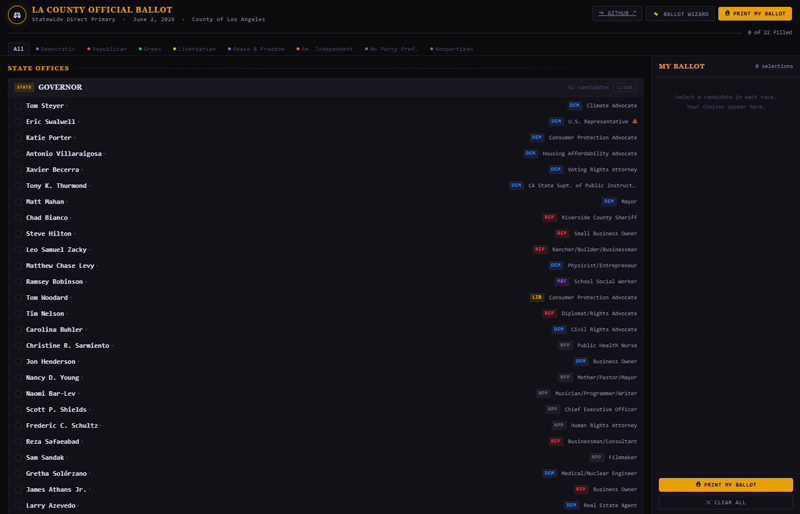
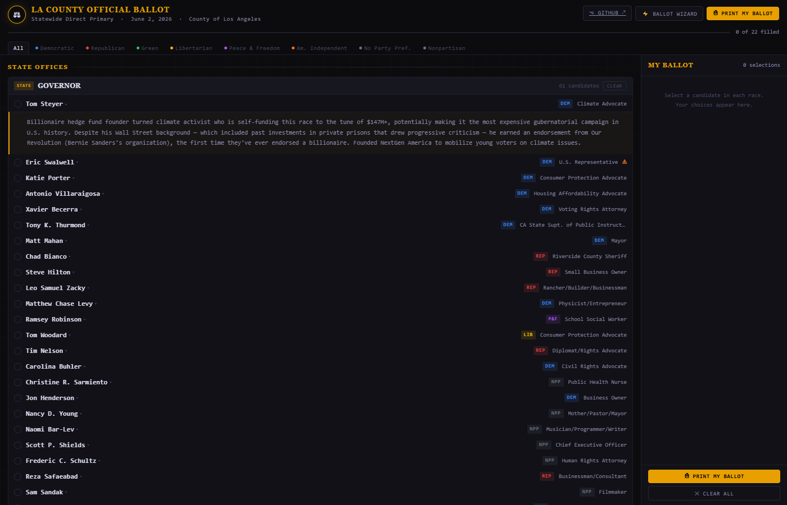
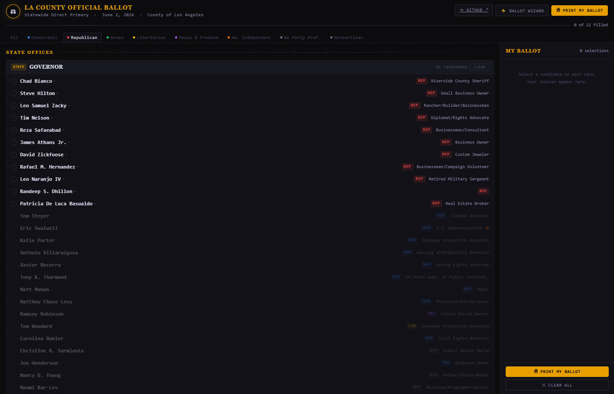
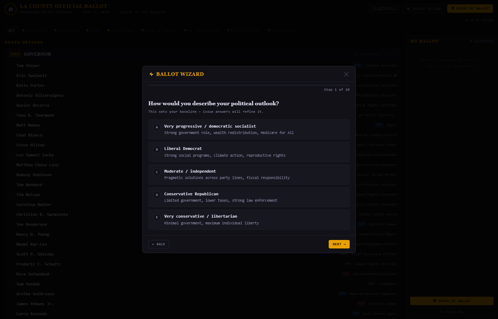
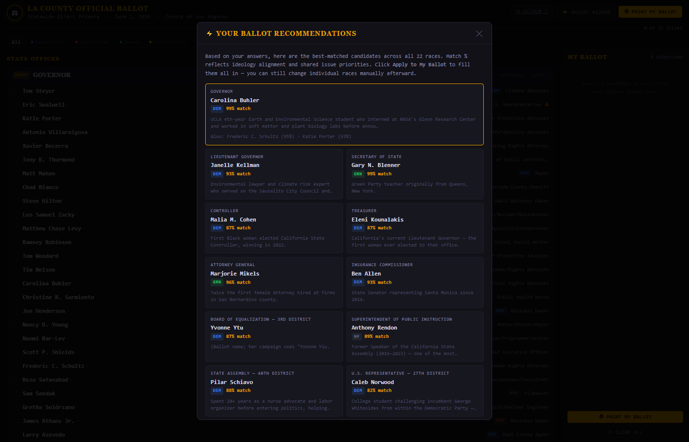
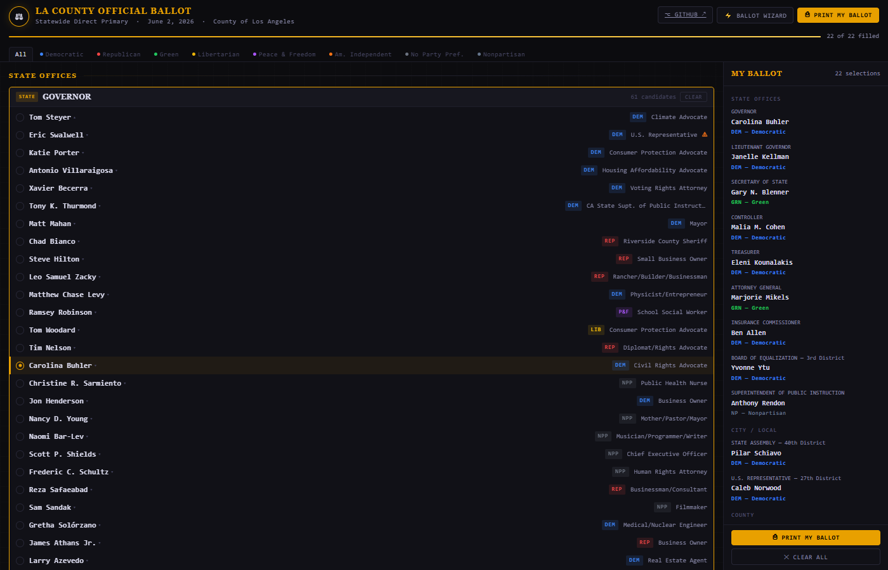

# LA County Primary Ballot Guide — June 2, 2026

An interactive voter guide for the **Los Angeles County Statewide Direct Primary Election, June 2, 2026**. Built as a single self-contained HTML file with no backend, no dependencies, and no build step — just open it in a browser.

🗳️ **Live site:** [dborges.github.io/la-ballot-guide-2026](https://dborges.github.io/la-ballot-guide-2026/)

---

## Screenshots

**Main ballot guide — all 22 races with party badges and bio dropdowns**


**Click any candidate name to expand their researched biography**


**Party filter — Republican selected, matching candidates sorted to top**


**⚡ Ballot Wizard — 10 questions about your values and policy positions**


**Wizard results — best-matched candidate for every race with match %**


**After applying — all 22 races filled in the My Ballot sidebar**


---

## What's Inside

**22 races · 164 candidates** across four sections:

| Section | Races |
|---|---|
| State Offices | Governor, Lt. Governor, Secretary of State, Controller, Treasurer, Attorney General, Insurance Commissioner, Board of Equalization (3rd District), Superintendent of Public Instruction |
| City / Local | State Assembly 40th District, U.S. Representative 27th District |
| County | Sheriff, Assessor |
| Judicial | Superior Court Offices 2, 14, 39, 60, 64, 65, 66, 81, 87 |

---

## Features

### ⚡ Ballot Wizard
Answer 10 questions about your values and policy positions — housing, climate, public safety, fiscal policy, education, healthcare, immigration, judge philosophy, and incumbent preference. The wizard scores every candidate using an ideology-alignment and issue-tag matching algorithm, then recommends the best-matched candidate in each of the 22 races. Click **Apply to My Ballot** to fill everything in at once.

### 📖 Candidate Bios
Click any candidate's name to expand a researched biography — career highlights, notable accomplishments, controversies, and why they're running. Bios sourced from Ballotpedia, CalMatters, LAist, EdSource, candidate websites, and Wikipedia.

### 🎛️ Party Filter
Filter all races by party (Democratic, Republican, Green, Libertarian, Peace & Freedom, American Independent, No Party Preference, Nonpartisan). When a party is selected, matching candidates sort to the top of each race card; non-matching candidates are dimmed but remain visible.

### 🗂️ My Ballot Sidebar
A sticky sidebar tracks your selections as you go, grouped by section. Click any entry to scroll back to that race. Shows a live count and progress bar (X of 22 races filled).

### ⎙ Print
The print stylesheet hides all UI chrome and renders only your selected candidates in a clean two-column layout — a physical cheat sheet to bring to the polling place.

---

## Ballot Photos

The `ballot-page-*.jpg` images in this repo are photos of the actual official ballot used in this election:

| File | Contents |
|---|---|
| `ballot-page-1-assembly-usrep-sheriff-assessor.jpg` | Page 1 — Instructions, Assembly 40th, US Rep 27th, Sheriff, Assessor |
| `ballot-page-2-superior-court-judges.jpg` | Page 2 — All 9 Superior Court judicial races |
| `ballot-page-5-governor.jpg` | Page 5 — Governor (main candidate list) |
| `ballot-page-6-governor-continued-ltgov.jpg` | Page 6 — Governor (continued) + Lieutenant Governor |
| `ballot-page-7-sos-controller-treasurer-ag-insurance.jpg` | Page 7 — Secretary of State, Controller, Treasurer, AG, Insurance Commissioner |
| `ballot-page-8-boe-superintendent-end-of-ballot.jpg` | Page 8 — Board of Equalization + Superintendent of Public Instruction (End of Ballot) |

> Pages 3 and 4 (additional Governor candidates) were not photographed.

---

## How It Works

Everything runs client-side in a single HTML file:

- **Data** — `BALLOT` array holds all 22 races and 164 candidates, each with name, party, ballot designation, and a researched bio
- **Scoring** — `SCORES` lookup table assigns each candidate an ideology score (1.0 = far left → 5.0 = far right), up to 3 issue tags, an incumbent flag, and a judicial background type (`prosecution / defense / civil`)
- **Wizard** — `wzBuildProfile()` computes a user profile from the 10 answers; `wzScoreCand()` runs a weighted formula: 60% ideology closeness + 40% issue-tag overlap + incumbent bonus/penalty
- **State** — selections stored in a `sel = {}` object (race ID → candidate name); cleared on page reload
- **No frameworks** — pure HTML, CSS, and vanilla JavaScript; no npm, no build step, no external CDN

---

## Special Scoring Notes

- **Judge Draper (Office 2)** — facing California Commission on Judicial Performance misconduct charges; his score is capped at 20% regardless of user answers, so his challenger almost always wins
- **Eric Swalwell** — suspended his campaign April 12, 2026 after misconduct allegations; flagged ⚠ on the ballot, and the wizard skips to the next-best match if he scores #1
- **Betty T. Yee** — withdrew from the Governor's race April 20, 2026; also flagged ⚠
- **Uncontested races** (Office 39 — Binh Q. Dang; Office 60 — Ann M. Maurer) — auto-selected at 100% match

---

## Running Locally

No build required. Just open the file:

```bash
open index.html          # macOS
start index.html         # Windows
xdg-open index.html      # Linux
```

Or serve it with any static file server:

```bash
npx serve .
python -m http.server 8080
```

---

## Data Sources

Candidate biographies and background information sourced from:
- [Ballotpedia](https://ballotpedia.org)
- [CalMatters 2026 Voter Guide](https://calmatters.org)
- [LAist Voter Guides](https://laist.com)
- [EdSource](https://edsource.org) (Superintendent of Public Instruction candidates)
- [LA County Bar Association JEEC Report 2026](https://www.lacba.org) (judicial candidates)
- Individual candidate campaign websites
- Wikipedia

---

## License

Public domain — do whatever you want with it.
